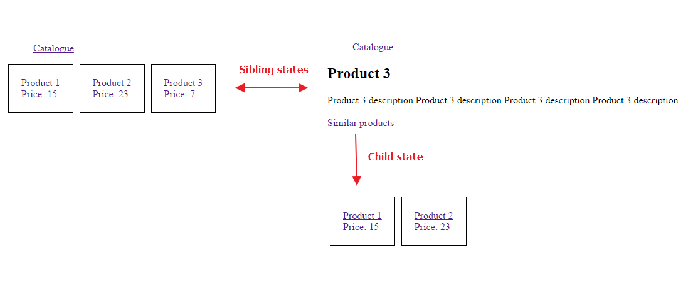

## Simple product catalogue example created with angular and ui-router



In this tutorial I will show you product catalogue example using ui-router. First I will tell you about ui-router's benefits over angular's default ngRoute module:

1. ui-router allows nested views.
2. You navigate using state names, url is defined in state configuration only once. This is very helpful because if you want to change some page's url, you have to do it in just one place.

These are two main, huge benefits of using ui-router. Almost every project needs these qualities when it's about routing. Let's follow step by step guide how to set up and configure ui-router's states:

### First we shall include necessary scripts

```html
<script src="https://ajax.googleapis.com/ajax/libs/angularjs/1.4.5/angular.min.js"></script>
<script src="https://cdnjs.cloudflare.com/ajax/libs/angular-ui-router/0.2.18/angular-ui-router.min.js"></script>
```
    
### Then create main module and set `ui.router` as dependency

```javascript
var app = angular.module('app', ['ui.router']);
```

### Configuring states
To set states, you shall inject `$stateProvider` into `app.config`:

```javascript
$stateProvider.state('catalogue', {
    url: '/catalogue',
    template: '<div>Catalogue view</div>'
});
```

Here we have defined state called "catalogue" with url `/catalogue`. We also indicate a template which will be loaded when navigating to `/catalogue`. Where this template will be inserted in html? For this purpose we have `ui-view` directive:

```html
<div ui-view></div>
```

So when navigating to `/catalogue`, `<div>Catalogue view</div>` will be loaded into `<div ui-view></div>` tag and we get:

```html
<div ui-view>
    <div>Catalogue view</div>
</div>
```

In real case you will probably want to use url of a template instead of inline html. So use `templateUrl` option instead of `template`.

Creating anchor tags for navigation:

```html
<a ui-sref="catalogue">Catalogue</a>
```

You write state name in `ui-sref` attribute. This directive will find out which url matches state name and puts `href` attribute, so it becomes:

```html
<a ui-sref="catalogue" href="/#/catalogue">Catalogue</a>
```

You can easily pass parameters like this: `ui-sref="catalogue({ foo: 'bar' })"`. Let's move on and configure controller:

```javascript
$stateProvider.state('catalogue', {
    url: '/catalogue',
    template: '<div>Catalogue view, {{foo}}</div>',
    controller: ['$scope', function ($scope) {
        $scope.foo = 'bar';
    }]
});
```

And we get:

```html
<div>Catalogue view, bar</div>
```

One more option that is also very useful is `resolve`, which prevents controller from being executed until data is received. For example:

```javascript
$stateProvider.state('catalogue', {
    url: '/catalogue',
    template: '<div>Catalogue view, {{products}}</div>',
    resolve: {
        // In real case you will fetch data with `$http` service here.
        products: ['$q', function ($q) {
            var deferred = $q.defer();
            setTimeout(function () {
                console.log('This is in timeout but will still happen before controller executes.');
                defered.resolve([1, 2, 3]);
            }, 2000);
            return deferred.promise;
        }]
    },
    // products are already available here, so you are avoiding any checks if products are loaded or not yet.
    controller: ['$scope', 'products', function ($scope, products) {
        console.log('This will happen later.');
        $scope.products = products;
    }]
});
```

### Nested states
You can add child state by adding `.` in state name. For example:

    foo // parent
    foo.bar // child of foo
    foo.bar.baz // child of foo.bar
