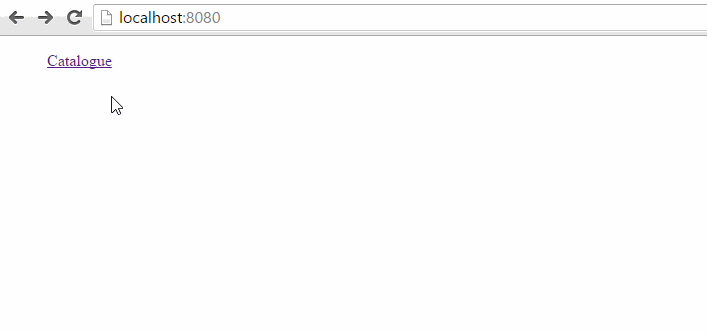
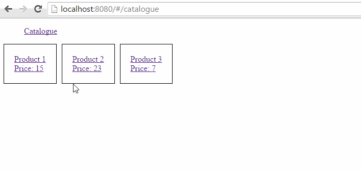
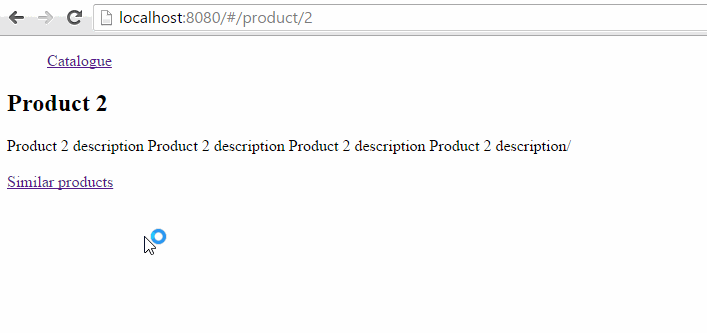

## Simple product catalogue example created with angular and ui-router


In this tutorial I will show you how to use ui-router in your project. First I will tell you about ui-router's benefits over angular's default ngRoute module:

1. ui-router allows nested views.
2. You navigate using state names, url is defined in state configuration only once. This is very helpful because if you want to change some page's url, you have to do it in just one place.

These are two main, huge benefits of using ui-router. Almost every project needs these qualities when it's about routing. Let's follow step by step guide how to set up and configure ui-router's states:

### First include necessary scripts

```html
<script src="https://ajax.googleapis.com/ajax/libs/angularjs/1.4.5/angular.min.js"></script>
<script src="https://cdnjs.cloudflare.com/ajax/libs/angular-ui-router/0.2.18/angular-ui-router.min.js"></script>
```
    
### Then create main module and set `ui.router` as dependency

```javascript
var app = angular.module('app', ['ui.router']);
```

### Configuring states
To set states, you shall inject `$stateProvider` into `app.config`:

```javascript
$stateProvider.state('catalogue', {
    url: '/catalogue',
    templateUrl: './views/catalogue.html',
    // Here we get products asynchronously and inject in controller.
    // Controller will not execute until `productSrvc.getAll()` promise gets resolved.
    resolve: {
        products: ['productSrvc', function (productSrvc) {
            return productSrvc.getAll();
        }]
    },
    // `products` is available thanks to resolve
    controller: ['$scope', 'products', function ($scope, products) {
        $scope.products = products;
    }]
});
```

Here we have defined state called "catalogue" with url `/catalogue`. We also indicate a template url which will be loaded when navigating to `/catalogue`. Where this template will be inserted in html? For this purpose we have `ui-view` directive under menu:

```html
<ul>
    <li>
        <a ui-sref="catalogue"> Catalogue </a>
    </li>
</ul>
        
<!-- Nested view container -->
<div ui-view></div>
```

For creating links we use `ui-sref` directive which will find out which url matches state name and puts `href` attribute, so it becomes:

```html
<ul>
    <li>
        <a ui-sref="catalogue" href="/#/catalogue"> Catalogue </a>
    </li>
</ul>
```

On clicking link we navigate to catalogue page:



### Product page
We shall create `product` state which is sibling of `catalogue` state:

```javascript
$stateProvider.state('product', {
    // Example: /product/3 where productId has value 3
    url: '/product/:productId',
    templateUrl: './views/product.html',
    // Get product by `productId` from path
    resolve: {
        product: ['$stateParams', 'productSrvc', function ($stateParams, productSrvc) {
            return productSrvc.getById($stateParams.productId);
        }]
    },
    controller: ['$scope', 'product', function ($scope, product) {
        $scope.product = product;
    }]
})
```

We want to navigate from catalogue to specific product page. Let's add following html in `views/catalogue.html`:

```html
<div class="catalogue">
    <a ng-repeat="product in products" ui-sref="^.product({ productId: product.id })">
        <div> {{product.name}} </div>
        <div> Price: {{product.price}} </div>
    </a>
</div>
```

Here we display brief information about product. Anchor tag will repeat as many times as many products we have, so `ui-sref` will create individual `href` attribute for each one. When we click on link, it will navigate to product page:



### Creating child state (similar products)
Child states are created by appending `.` + name to parent state:

```javascript
$stateProvider.state('product.similars', {
    // This is child state, so it will inherit url from parent
    // For example this will match: /product/2/similars
    url: '/similars',
    templateUrl: './views/similars.html',
    // Get similar products. You can see that we can inject another resolve.
    // In this case it will execute after product promise resolves
    resolve: {
        similarProducts: ['product', 'productSrvc', function (product, productSrvc) {
            return productSrvc.getSimilars(product.id);
        }]
    },
    controller: ['$scope', 'similarProducts', function ($scope, similarProducts) {
        $scope.similarProducts = similarProducts;
    }]
});
```

So `product.similars` is child state of `product`. Child state's url is appended to parent states recursively. In this case, url `/product/2/similars` will match `product.similars` state and loads its template:




So when navigating to `/catalogue`, `<div>Catalogue view</div>` will be loaded into `<div ui-view></div>` tag and we get:

```html
<div ui-view>
    <div>Catalogue view</div>
</div>
```

In real case you will probably want to use url of a template instead of inline html. So use `templateUrl` option instead of `template`.

Creating anchor tags for navigation:

```html
<a ui-sref="catalogue">Catalogue</a>
```

You write state name in `ui-sref` attribute. This directive will find out which url matches state name and puts `href` attribute, so it becomes:

```html
<a ui-sref="catalogue" href="/#/catalogue">Catalogue</a>
```

You can easily pass parameters like this: `ui-sref="catalogue({ foo: 'bar' })"`. Let's move on and configure controller:

```javascript
$stateProvider.state('catalogue', {
    url: '/catalogue',
    template: '<div>Catalogue view, {{foo}}</div>',
    controller: ['$scope', function ($scope) {
        $scope.foo = 'bar';
    }]
});
```

And we get:

```html
<div>Catalogue view, bar</div>
```

One more option that is also very useful is `resolve`, which prevents controller from being executed until data is received. For example:

```javascript
$stateProvider.state('catalogue', {
    url: '/catalogue',
    template: '<div>Catalogue view, {{products}}</div>',
    resolve: {
        // In real case you will fetch data with `$http` service here.
        products: ['$q', function ($q) {
            var deferred = $q.defer();
            setTimeout(function () {
                console.log('This is in timeout but will still happen before controller executes.');
                defered.resolve([1, 2, 3]);
            }, 2000);
            return deferred.promise;
        }]
    },
    // products are already available here, so you are avoiding any checks if products are loaded or not yet.
    controller: ['$scope', 'products', function ($scope, products) {
        console.log('This will happen later.');
        $scope.products = products;
    }]
});
```

### Nested states
You can add child state by adding `.` in state name. For example:

    foo // parent state name
    foo.bar // child of foo
    foo.bar.baz // child of foo.bar
    
Child states inherit url of parent state, if `foo` state has url `/foo` and `foo.bar` state has url `/bar`, then when navigating on `/foo/bar` it will load `foo` state and `foo.bar` inside it. Child state's html content will be loaded in parent state's `<div ui-view></div>` element. You can see nesting example by running demo app.

### Running demo app
1. Clone repository `git clone https://github.com/karaxuna/tutorial-product-catalogue-ui-router`
2. [Install nodejs](https://nodejs.org/en/download/)
3. In project root run `npm install`
4. Run `npm start`
5. Visit `http://localhost:8080`

You can see more information on [ui-router's main page](https://angular-ui.github.io/ui-router/site/#/api/ui.router).
